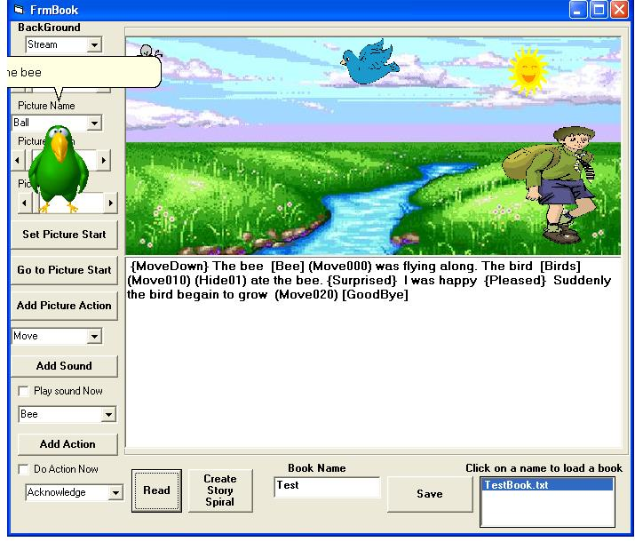



## Story Book

### Description

MsAgent. You can write a story that includes sounds and actions and have the computer read it back to you. Improved!!!
 
### More Info
 
Reads all the sounds and wmf files that are in the same directory

             |
---                |---
**Submitted On**   |2007-03-31 15:58:28
**By**             |[Bill Perkett](https://github.com/Planet-Source-Code/PSCIndex/blob/master/ByAuthor/bill-perkett.md)
**Level**          |Advanced
**User Rating**    |4.0 (12 globes from 3 users)
**Compatibility**  |VB 6\.0
**Category**       |[Games](https://github.com/Planet-Source-Code/PSCIndex/blob/master/ByCategory/games__1-38.md)
**World**          |[Visual Basic](https://github.com/Planet-Source-Code/PSCIndex/blob/master/ByWorld/visual-basic.md)
**Archive File**   |[Story\_Book205846442007\.zip](https://github.com/Planet-Source-Code/bill-perkett-story-book__1-62569/archive/master.zip)

